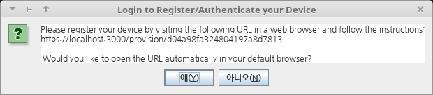
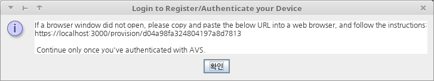
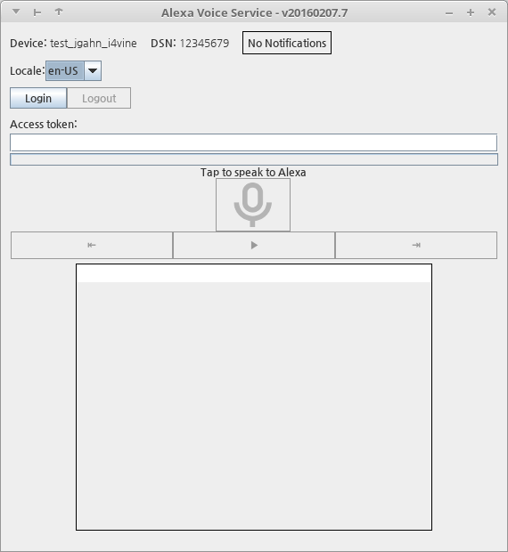
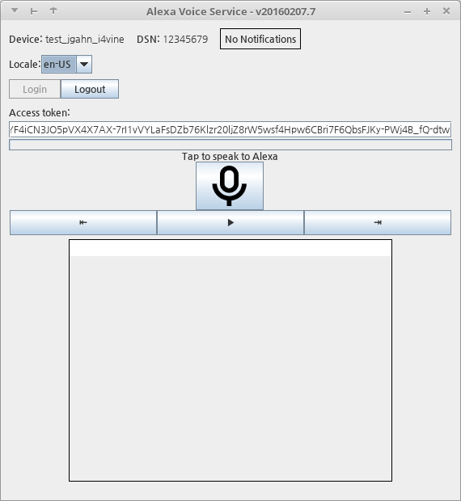

# Quick Start Guide - Sample App

**본 문서는 alexa-avs-sample-app을 PC에서 가능한 패키지 설치를 통해 빨리 빌드하는 방법에 대해 기술한다.**

- [환경](#환경)
- [사용 디렉토리](#사용-디렉토리)
- [필요 유틸리티 설치 및 사전 설정](#필요-유틸리티-설치-및-사전-설정)
- [alexa-avs-sample-app 다운로드](#alexa-avs-sample-app-다운로드)
- [인증 정보 생성](#인증-정보-생성)
    - [ssl.cnf 파일 수정](#sslcnf-파일-수정)
    - [인증 생성 스크립트 실행](#인증-생성-스크립트-실행)
    - [Node.js 서버 설정](#nodejs-서버-설정)
    - [앱 설정](#앱-설정)
- [Node.js 서버 실행](#nodejs-서버-실행)
- [Sample App 실행](#sample-app-실행)

### 환경
이 문서의 작업 환경은 다음과 같다.
 * Intel Core i5-2500 CPU @ 3.3GHz × 4
 * 4GB RAM
 * 500GB HDD
 * Linux Mint 18.3 Cinnamon 64-bit
    * Kernel 4.10.0-42

### 사용 디렉토리
```sh
export WS=$HOME/workspaces/amazon
mkdir -p $WS
cd $WS
```

### 필요 유틸리티 설치 및 사전 설정
큰 문제 없이 진행 하기 위해 `npm`, `nodejs`, `jdk`, `maven`, `openssl`이 필요하다. 그냥 패키지 매니저를 사용해 설치해도 큰 문제는 없을 것 같다.
```sh
sudo apt install npm nodejs nodejs-legacy openjdk-8-jdk maven openssl
```
다만, 필자는 다른 문제가 생겨 `npm`과 `nodejs`는 따로 설치하였다. `npm`은 `node`에 포함되어 있어 사실상 `node`만 [github](https://github.com/nodejs/node)에서 받아 설치하였다.
```sh
sudo apt install openjdk-8-jdk maven openssl
git clone https://github.com/nodejs/node.git
cd node
./configure
make
make test
sudo make install
```

### alexa-avs-sample-app 다운로드 
```sh
git clone https://github.com/alexa/alexa-avs-sample-app.git
cd alexa-avs-sample-app
export WS=$PWD
```

### 인증 정보 생성

#### ssl.cnf 파일 수정
```sh
cd $WS/samples/javaclient
vi ssl.cnf
```
수정한 파일 내용은 다음과 같다. 맨 아래의 **[req_distinguished_name]** 항목에 **YOUR_**라고 표시된 부분만 알맞게 채워 넣으면 된다.
```sh
[req]
distinguished_name      = req_distinguished_name
prompt                  = no

[v3_req]
subjectAltName          = @alt_names

[alt_names]
DNS.1                   = localhost
IP.1                    = 127.0.0.1
IP.2                    = 10.0.2.2

[req_distinguished_name]
commonName              = $ENV::COMMON_NAME                 # CN=
countryName             = KR                 # C=
stateOrProvinceName     = Gyeonggi-do            # ST=
localityName            = Seongnam-si                         # L=
organizationName        = i4vine                 # O=
organizationalUnitName  = TRC2          # OU=
```

#### 인증 생성 스크립트 실행
```sh
chmod +x generate.sh
./generate.sh
```
진행 과정 중 **Product ID**와 **Serial Number**를 입력해야 한다. 아마존 개발 계정의 알렉사에 등록한 제품 아이디를 **Product ID**로 적고, **Serial Number**는 기 등록된 것과 겹치지 않도록만 아무 숫자나 넣어 준다. **Password for Keystores**도 요구하는데, 테스트 목적이라면 그냥 아무것도 적지 않고 엔터로 넘긴다.
```
Product ID: test_jgahn_i4vine
Serial Number: 12345678
Password for Keystores (won't echo): Generating RSA private key, 4096 bit long modulus
................................................................................................................................................................................................................................................................................................................................................................................................................................................................++
............++
e is 65537 (0x10001)
Generating RSA private key, 2048 bit long modulus
..................+++
...............+++
e is 65537 (0x10001)
Signature ok
subject=/CN=test_jgahn_i4vine:12345678/C=KR/ST=Gyeonggi-do/L=Seongnam-si/O=i4vine/OU=TRC2
Getting CA Private Key
Generating RSA private key, 2048 bit long modulus
....................................................................................+++
............+++
e is 65537 (0x10001)
Signature ok
subject=/CN=localhost/C=KR/ST=Gyeonggi-do/L=Seongnam-si/O=i4vine/OU=TRC2
Getting CA Private Key
Generating RSA private key, 2048 bit long modulus
.....................+++
.....................................................+++
e is 65537 (0x10001)
Signature ok
subject=/CN=localhost/C=KR/ST=Gyeonggi-do/L=Seongnam-si/O=i4vine/OU=TRC2
Getting CA Private Key
```

#### Node.js 서버 설정
```sh
vi $WS/samples/companionService/config.js
```
앞서 `generate.sh` 스크립트로 생성된 키 및 인증 파일 위치를 채워 넣는다. 수정할 항목은 **config.sslKey**, **config.sslCert**, **config.sslCaCert**이다.
```javascript
    ...
    sslKey: '<absolute path of $WS/samples/javaclient/certs/server/node.key>',
    sslCert: '<absolute path of $WS/samples/javaclient/certs/server/node.crt>',
    sslCaCert: '<absolute path of $WS/samples/javaclient/certs/ca/ca.crt>',
    ...
```

#### 앱 설정
```sh
vi $WS/samples/javaclient/config.json
```
역시 키와 인증 파일 위치를 채워 넣는다. 수정할 항목은 **companionApp.sslKeyStore**, **companionService.sslClientKeyStore**, **companionService.sslCaCert**이다.
```json
    ...
    "companionApp":{
        ...
        "sslKeyStore":"<absolute path of $WS/samples/javaclient/certs/server/jetty.pkcs12>",
        ...
    },
    "companionService":{
        ...
        "sslClientKeyStore":"<absolute path of $WS/samples/javaclient/certs/client/client.pkcs12>",
        ...
        "sslCaCert":"<absolute path of $WS/samples/javaclient/certs/ca/ca.crt"
    }
    ...
```

### Node.js 서버 실행
```sh
cd $WS/samples/companionService
npm install
```
이후 AVS 계정 설정을 진행한다.
```sh
vi config.js
```
파일에서 마저 채워 넣을 항목은 **config.clientId**, **config.clientSecret**, **config.products** 이다. **config.clientId**와 **config.clientSecret**은 AVS 개발자 페이지에 등록해 생성 받은 값을 채워 넣고, **config.products**는 `{<Product ID>: [<Serial Number>]}` 형태로 넣는다. 다음을 참고한다.
```js
    ...
    clientId: '<actual amazon client ID>',
    clientSecret: '<actual amazon client secret>',
    ...
    products: {
        "test_jgahn_i4vine": ["12345678"], // Fill in with valid device values, eg: "testdevice1": ["DSN1234", "DSN5678"]
    },
    ...
```
이후 다음 명령으로 인증 서버를 실행한다.
```sh
npm start

> alexa-voice-service-sample-companion-service@1.0.0 start /home/jgahn/workspaces/amazon/alexa-avs-sample-app/samples/companionService
> nodejs ./bin/www

This node service needs to be running to store token information memory and vend them for the AVS app.

Listening on port 3000
```

### Sample App 실행
```sh
cd $WS/samples/javaclient
```
빌드 하기 전 설정 파일을 마저 채워 넣는다.
```sh
vi config.json
```
설정 할 내용은 **productId**, **dsn**, **provisioningMethod**이다. **productId**와 **dsn**(device serial number)는 각각 서버 설정 파일(config.js)의 **config.products**의 *Product ID*와 *Serial Nubmer*와 같은 값을 입력해 주면 된다. **provisioningMethod**는 반드시 `companionService`로 둔다.
```json
    ...
    "productId":"test_jgahn_i4vine",
    "dsn":"13246578",
    "provisioningMethod":"companionService",
    ...
```
이후 설정값들의 유효성을 확인하고 빌드, 실행을 한다.
```sh
mvn validate
mvn install
mvn exec:exec
```
그러면 다음과 같은 창을 볼 수 있다.

**예(Y)** 를 선택하면 브라우저에 아마존 로그인 창이 뜨고, 로그인을 완료하면 *`device tokens ready`* 라는 글이 표시된다. 그러면 위 그림의 창은 다음 창으로 바뀌어 있다.

**확인**을 누르면 앱이 로그인되어 *Access token*이 채워지고 사용 가능 상태가 된다.

PC에서는 아직 별도의 Wake-up word를 활성화할 수 없으므로 마이크 모양 아이콘을 눌러 말을 하면 응답이 온다.
